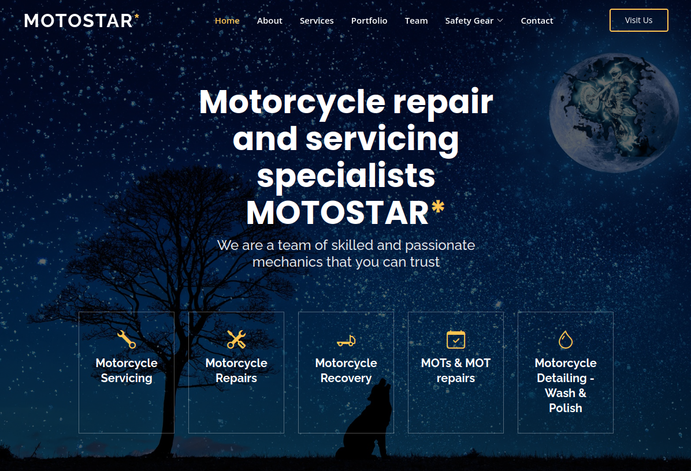

# 0008-the-best-landing-page-in-bootstrap

**A website for a Motorcycle Repair Shop**

This is a website for a motorcycle repair shop.    
What I did to save time was to download a template from https://bootstrapmade.com and then edit that template with my own text and my own assets like pictures and custom data.  

I used assets and pictures from:     
- Unsplash  
- Pixabay   
- Pexels  
- Gumtree adds   
- Inspired myself from other Motorcycle websites  
- Stock Up

I named the motorcycle repair shop MOTOSTAR* because I thought it sounds good as a repair shop name.

Below is a screenshot of the **hero** area of the my website:

--------------------------------------

Template Name: Gp    
Template URL: https://bootstrapmade.com/gp-free-multipurpose-html-bootstrap-template/    
Author: BootstrapMade.com    
License: https://bootstrapmade.com/license/    

